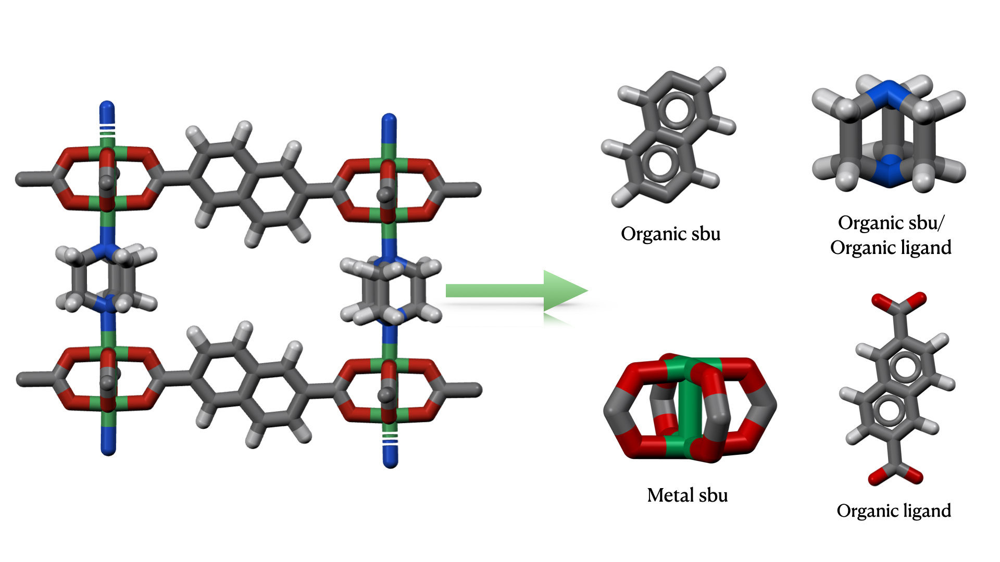

# mofstructure


This is an elaborate python module that provides simple functions for
manipulation metal-organic frameworks and other porous systems such as
COFs and Zeolites. Some uses of the module involves

1. Computation of geometric properties of MOFs. It calls zeo++ in the background and enables a quick computation of all porosity information such pld, lcd, asa ...

2. Automated removal of unbound guest molecules

3. Deconstruction of metal-organic frameworks into building units. And for each buidling units (organic ligand, metal cluster, organic sbu and metal sbu) computes their cheminformatic identifiers such as SMILES strings, inchi and inchikey. It also identify the type of metal sbu and coordination number of central metal.

4. Wraps systems around unit cell so as to remove effect of pbc. This is often the case, when one tries to visualize the cif files or convert cif files into xyz, the system often appears to be uncoordinated

5. Seperation of building units into regions. This is essential when on wishes to subsitute a specific ligand or building unit.

## Installation

### Option 1

```bash
pip install mofstructure
```

### Option 2

```bash
  git clone https://github.com/bafgreat/mofstructure.git mofstructure
  cd mofstructure
  pip install .
```

## Quick start

### Run on the commandline

#### Building units

Simply run the following command on a cif file or any ase readable file format containing a MOF.

```bash
mofstructure cif_file
```

The script will deconstruct the MOF present in the cif file and load the output in a folder called 'MOF_building_units' in the current directory/folder. If you wish to load the output in a specific folder, simply add the path to the folder as follows:

```bash
mofstructure cif_file path_to_result_folder
```

For multiple cif files. Simply run a loop and all the Results will be saved in the

```bash
for cifs in ciffiles:
    mofstructure cifs path_to_result
```

#### Creating a database

If you have a folder containg many cif files for different MOF, you could easily create a database. To create such a database, simply run the following command.

```bash
mofstructure_database ciffolder
```

Here the 'ciffolder' is the folder containing the cif files. The ouput will be saved in the default folder called 'MOFDb' in the current folder. Again you can choose the path to the save folder by simply listing it at the end of the command.

```bash
mofstructure_database ciffolder path_to_result
```

### Use as a libray

```Python
from  mofstructure import structure

"""
you can parse in a filename or an ase atom
"""

mof_object = structure.MOFstructure(filename=cif_file)

# once and also directly parse an ASE atom object
# mof_object = structure.MOFstructure(ase_atoms)

# guest free structure

guest_free_ase_atoms = mof_object.remove_guest()

# compute porosit and write output to csv
pores = mof_object.get_porosity(probe_radius=1.86, number_of_steps=5000,  rad_file=None,high_accuracy=True)
df = pd.DataFrame(pores, index=[0])
df.to_csv('pore.csv')
```

#### sbus and linkers

Compute sbus and linkers

```Python
metal_sbus, organic_sbus = mof_object.get_sbu(wrap_system=True, cheminfo=True, add_dummy=False)

organic_ligands = mof_object.get_ligands(wrap_system=True, cheminfo=True, add_dummy=False)
```

#### when cheminfo = True

openbabel is called to compute all chemifomatic information,
which are all stored on the ase_atom.info
metal_sbus and organic_sbus list that contains all the unique instances of the metal sbus and organic sbus.

#### extracting cheminfor

For each instance in a building unit the various chemiformatic informations are as follows.

```Python
for i,  sbu in enumerate(metal_sbus):
    smi = sbu.info['smi']
    inchi = sbu.info['inchi']
    inchikey = sbu.info['inchikey']
    # for sbus only
    number_of_point_of_extension = sbu.info['point_of_extension']
    #for metal sbus only
    sbu_type = sbu.info['sbu_type'] # sbu_type :rodlike, irmof, uoi66, paddlewheel e.t.c
    # write
    sbu.write('metal_sbu_'+str(i)+'.cif')
```

### open metal site, metal coordination number/environment

```python
oms =  mof_object.get_oms()
print(oms)
```

<!-- ### for a single cif file

```Python
from  mofstructure import buildingunits
buildingunits.work_flow(ciffile, result_folder)
```

### for multiple cif files

```Python
from  mofstructure import buildingunits
import glob
all_cifs = glob.glob(folder/*cif)
# folder corresponds to the folder containing all the cif files
for cif_files in all_cifs:
    buildingunits.work_flow(cif_files, result_folder)
# Note that result_folder can be any path. If the path does not exist, it will create one and populate it with all the data.
``` -->

## Documentation

You can access the full project documentation on [docs](https://bafgreat.github.io/mofstructure/)

## Roadmap

In the future the code should be able to:

1. Compute rcsr topological code
2. Subsitutue building units in a MOF to enable framework functionalisation
3. Automatic curation of cifs
4. Decontsruction of COFs into their building units
   <!--  -->

<!-- ![proccess]source/(images/guest.png) -->

<!-- # Updates version 0.1.4

The new update enables the computation of open metal sites in cifs
To use this functionality run the following on the command line

```
mofstructure_database ciffolder --oms
```

Here ciffolder corresponse to the directory/folder containing the cif files.

After the computation the metal information will be found in a json file called `metal_info.json`. This file is found in the output folder that defaults to `MOFDb` incase none is provided.

# NB

Note that computing open metal sites is computationally expensive, especially if you intend to
run it on a folder with many cif files. There I recommend that if you are not interested in computing the open metal sites simply run command without the --oms option.

```
mofstructure_database ciffolder
```

This command will generate a MOFDb folder without the `metal_info.json` file. But the code will run very fast.

Also note that the `--oms` option is provided on for the `mofstructure_database` command. This is not available for `mofstructure` command which targets a single cif file. If you have a single cif file wish to compute open metal sites, simply put the cif file in a folder and rin `mofstructure_database` command on the folder (`mofstructure_database ciffolder --oms`).

# Updates version 0.1.5

The new update enables users to include a Rad file when computing porosity using pyzeo. This allows users to specify the type of radii to use. If omitted, the default pyzeo radii will be used, which are covalent radii obtained from the CSD.

Currently, this functionality can only be used when using mofstructure as a library. This can be done as follows:

```
from mofstructure.porosity import zeo_calculation
from ase.io import read

ase_atom = read(filename)

pore_data = zeo_calculation(ase_atom, rad_file='rad_file_name.rad')
```

# NB

Note that filename is any ASE-readable crystal structure file, ideally a CIF file. Moreover, rad_file_name.rad is a file containing the radii of each element present in the structure file. This should be formatted as follows:

```
element radii
```

For example, for an MgO system, your Rad file should look like this:

```
Mg 0.66
O 1.84
```

Also note that of the radii file does not have the .rad extension like `rad_file_name.rad` the default radii will be used.

# Updates version 0.1.6

Added new command line tools to expedite calculations especially when working on a quite large database.

## compute only deconstruction

If you wish to only compute the deconstruction of MOFs without having to compute
their porosity and open metal sites. Then simply run the following command

```
mofstructure_building_units  cif_folder
```

## compute only porosity

If you wish to only compute the porosity using default values. i.e
probe radius = 1.86, number of gcmc cycles = 10000 and default csd atomic radii, then run the following command:

```
mofstructure_porosity cif_folder
```

However, if you wish to use another probe radius of maybe 1.5 and gcmc cycles of 20000 alongside custom atomic radii in a file called rad.rad, run the following command:

```
mofstructure_porosity cif_folder -pr 1.5 -ns 20000 -rf rad.rad
```

## compute only open metal sites

If you are only interested in computing the open metal sites, then running the following command

```
mofstructure_oms cif_folder
```

# Updates version 0.1.7

1. Implemented a robust CI/CD using git actions
2. Included add_dummy key to add dummy atoms to point of extension. This is important to effectively control the breaking point. This dummy atoms can then
   be replaced with hydrogen to fully neutralize the system.

## N.B.

Be please don't use add dummy when deconstructing to ligands and clusters. The add dummy argument should be used only for sbus.
e.g

```
connected_components, atoms_indices_at_breaking_point, porpyrin_checker, all_regions = MOF_deconstructor.secondary_building_units(ase_atom)
metal_sbus, organic_sbus, building_unit_regions = MOF_deconstructor.find_unique_building_units(
    connected_components,
    atoms_indices_at_breaking_point,
    ase_atom,
    porpyrin_checker,
    all_regions,
    cheminfo=True,
    add_dummy=True
    )

metal_sbus[0].write('test1.xyz)
``` -->
